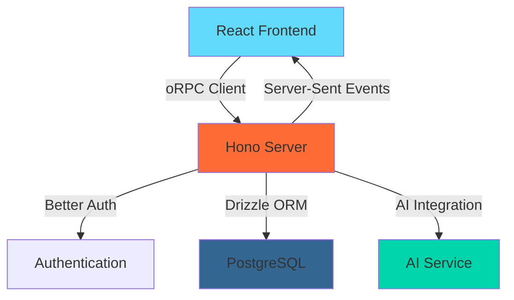

# Modern JavaScript/TypeScript Ecosystem
## Building a Real-time Chat Application

A comprehensive overview of our tech stack and architecture

<div class="pt-12">
  <span @click="$slidev.nav.next" class="px-2 py-1 rounded cursor-pointer" hover="bg-white bg-opacity-10">
    Press Space for next page <carbon:arrow-right class="inline"/>
  </span>
</div>

<div class="abs-br m-6 flex gap-2">
  <button @click="$slidev.nav.openInEditor()" title="Open in Editor" class="text-xl slidev-icon-btn opacity-50 !border-none !hover:text-white">
    <carbon:edit />
  </button>
  <a href="https://github.com/slidevjs/slidev" target="_blank" alt="GitHub"
    class="text-xl slidev-icon-btn opacity-50 !border-none !hover:text-white">
    <carbon-logo-github />
  </a>
</div>

---
transition: fade-out
---

# Agenda

<Toc maxDepth="1"></Toc>

---
layout: default
---

# Opening: Why This Stack Now?

<div class="grid grid-cols-2 gap-8">
<div>

## The Problem
- **Type Safety**: JavaScript's dynamic nature leads to runtime errors
- **Developer Experience**: Poor tooling and slow feedback loops
- **Performance**: Inefficient bundling and runtime overhead
- **Scalability**: Monolithic architectures don't scale well

</div>
<div>

## The Solution
- **TypeScript**: End-to-end type safety
- **Modern Tooling**: Fast development with Bun, Vite
- **Type-safe APIs**: oRPC for contract-first development
- **Component Libraries**: shadcn/ui for consistent design
- **Real-time Features**: Server-Sent Events for live updates

</div>
</div>

<div class="mt-8 p-4 bg-blue-50 dark:bg-blue-900/20 rounded-lg">
💡 <strong>Key Insight:</strong> This stack prioritizes developer experience while maintaining production performance and type safety across the entire application.
</div>

---
layout: two-cols
---

# Architecture Overview

<div class="pr-4">

## Monorepo Structure
```
hono-orpc/
├── apps/
│   ├── api/          # Hono backend
│   └── web/          # React frontend
├── packages/
│   ├── db/           # Drizzle schema
│   └── ai/           # AI integration
└── playground/
    └── presentation/ # This slideshow!
```

## Tech Stack Highlights
- **Runtime**: Bun (fast JavaScript runtime)
- **Backend**: Hono + oRPC + Better Auth
- **Frontend**: React + TanStack Router/Query
- **Database**: PostgreSQL + Drizzle ORM
- **UI**: shadcn/ui + Tailwind CSS
- **Type Safety**: TypeScript everywhere

</div>

::right::

<div class="pl-4">

## Data Flow



## Key Benefits
- 🚀 **Performance**: Bun runtime + optimized bundling
- 🔒 **Type Safety**: Contract-first API development
- 🔄 **Real-time**: SSE for live chat updates
- 🎨 **Modern UI**: Component-based architecture
- 🧪 **DX**: Hot reload, devtools, linting

</div>

---
layout: default
---

# Repository Tour

<div class="grid grid-cols-3 gap-4 text-sm">

<div class="space-y-2">

## Backend (`apps/api`)
```typescript
// Main server setup
import { Hono } from "hono"
import { OpenAPIHandler } from "@orpc/openapi/fetch"

const app = new Hono()
  .use("*", serveWebApp)
  .use(logger())
  .basePath("/api")
  .on(["POST", "GET"], "/auth/**", 
    (c) => auth.handler(c.req.raw))
```

**Key Features:**
- oRPC contract-based routing
- Better Auth integration
- Middleware system
- OpenAPI documentation

</div>

<div class="space-y-2">

## Frontend (`apps/web`)
```typescript
// Router setup with context
const router = createRouter({
  routeTree,
  context: {
    ...TanStackQueryProviderContext,
    auth: undefined!,
  },
  defaultPreload: "intent",
})

// Type-safe routing
declare module "@tanstack/react-router" {
  interface Register {
    router: typeof router;
  }
}
```

**Key Features:**
- File-based routing
- Type-safe navigation
- Query integration
- Auth context

</div>

<div class="space-y-2">

## Database (`packages/db`)
```typescript
// Drizzle schema definition
export const message = pgTable("message", {
  id: serial("id").primaryKey(),
  uuid: uuid("uuid").defaultRandom(),
  content: text("content").notNull(),
  channelUuid: uuid("channel_uuid")
    .references(() => channel.uuid),
  senderId: integer("sender_id")
    .references(() => user.id),
})
```

**Key Features:**
- Type-safe queries
- Migrations
- Relations
- Schema validation

</div>

</div>

---
layout: section
---

# Backend Deep Dive
## Hono + oRPC + Better Auth + Drizzle

---
layout: two-cols
---

# Hono Framework

<div class="pr-4">

## Why Hono?
- **Ultrafast**: Built for edge runtimes
- **Lightweight**: Minimal overhead
- **Web Standards**: Built on Web APIs
- **TypeScript**: First-class TS support

## Key Features
```typescript
// Middleware system
app.use("*", serveWebApp)
app.use(logger())

// Route handlers
app.basePath("/api")
app.on(["POST", "GET"], "/auth/**", 
  (c) => auth.handler(c.req.raw))
```

</div>

::right::

<div class="pl-4">

## oRPC Integration

```typescript
// Contract definition
const messageContract = oc
  .route({
    tags: ["chat", "message"],
    method: "POST",
    path: "/chat/channel/{uuid}/message",
  })
  .input(z.object({
    uuid: z.uuid(),
    content: z.string().min(1),
  }))
  .output(messageSchema)

// Handler implementation
const handler = new OpenAPIHandler(router, {
  plugins: [new OpenAPIReferencePlugin({
    schemaConverters: [new ZodToJsonSchemaConverter()],
  })],
})
```

**Benefits:**
- Contract-first development
- Auto-generated OpenAPI docs
- Type-safe client generation

</div>

---
layout: default
---

# Better Auth + Drizzle Integration

<div class="grid grid-cols-2 gap-8">

<div>

## Better Auth Setup
```typescript
export const auth = betterAuth({
  database: drizzleAdapter(db, {
    provider: "pg",
  }),
  emailAndPassword: {
    enabled: true,
  },
  socialProviders: {
    google: {
      prompt: "select_account",
      clientId: process.env.GOOGLE_CLIENT_ID,
      clientSecret: process.env.GOOGLE_CLIENT_SECRET,
    },
  },
})
```

**Features:**
- Multiple auth providers
- Session management
- Database integration
- Type-safe user context

</div>

<div>

## Drizzle Schema
```typescript
export const user = pgTable("user", {
  id: serial("id").primaryKey(),
  email: text("email").unique().notNull(),
  name: text("name").notNull(),
  avatar: text("avatar"),
  createdAt: timestamp("created_at").defaultNow(),
})

export const channel = pgTable("channel", {
  id: serial("id").primaryKey(),
  uuid: uuid("uuid").defaultRandom(),
  name: text("name").notNull(),
  settings: json("settings").$type<ChannelSettings>()
    .default(defaultChannelSettings),
})
```

**Benefits:**
- Type-safe queries
- Automatic migrations
- IntelliSense support

</div>

</div>

---
layout: default
---

# Real-time Features with Server-Sent Events

<div class="grid grid-cols-2 gap-6">

<div>

## Backend: Event Publisher
```typescript
// Message router with SSE
const publisher = new EventPublisher<
  Record<string, Message & { sender: User | null }>
>()

const saveAndPublishMessage = async ({
  channelUuid, content, sender
}) => {
  const [msg] = await db.insert(message)
    .values({ channelUuid, content, senderId: sender.id })
    .returning()

  // Publish to subscribers
  publisher.publish(channelUuid, {
    ...msg, sender
  })
}

// Stream endpoint
const streamChannelMessages = messageRouter
  .streamChannelMessages
  .handler(async function* ({ input, signal }) {
    for await (const payload of 
      publisher.subscribe(input.uuid, { signal })) {
      yield payload
    }
  })
```

</div>

<div>

## Contract Definition
```typescript
const streamChannelMessages = messageContract
  .route({
    method: "GET",
    description: "Stream messages by channel",
    path: "/chat/channel/{uuid}/message/stream",
  })
  .input(z.object({ 
    uuid: z.uuid() 
  }))
  .output(
    eventIterator(
      messageSchema.extend({ 
        sender: userSchema.nullable() 
      })
    )
  )
```

**Key Benefits:**
- Real-time message delivery
- Type-safe event streaming
- Automatic reconnection
- Memory efficient
- Works across browser tabs

</div>

</div>

---
layout: section
---

# Frontend Deep Dive
## React + TanStack Router + TanStack Query + shadcn/ui

---
layout: default
---

# TanStack Router: File-based Routing

<div class="grid grid-cols-2 gap-6">

<div>

## Route Structure
```
src/routes/
├── __root.tsx           # Root layout
├── index.tsx           # Home page
├── _protected/         # Auth required
│   ├── route.tsx      # Protected layout
│   ├── chat.tsx       # Chat list
│   └── chat.$uuid/    # Dynamic chat room
│       └── index.tsx
└── auth/
    ├── sign-in.tsx
    └── sign-up.tsx
```

## Type-safe Navigation
```typescript
// Auto-generated route tree
declare module "@tanstack/react-router" {
  interface Register {
    router: typeof router;
  }
}

// Usage with full type safety
const navigate = useNavigate()
navigate({ to: '/chat/$uuid', params: { uuid: 'abc-123' } })
```

</div>

<div>

## Route Definition
```typescript
// Protected route with auth check
export const Route = createFileRoute('/_protected/chat/$uuid/')({
  loader: async ({ context: { queryClient }, params }) => {
    // Prefetch data
    await Promise.all([
      queryClient.ensureQueryData(
        orpc.chat.channel.getChannel.queryOptions({
          input: { uuid: params.uuid }
        })
      ),
      queryClient.ensureQueryData(
        orpc.chat.message.getChannelMessages.queryOptions({
          input: { uuid: params.uuid }
        })
      ),
    ])
  },
  component: RouteComponent,
})
```

**Benefits:**
- File-based routing
- Automatic code splitting
- Data preloading
- Type-safe params

</div>

</div>

---
layout: default
---

# TanStack Query: Server State Management

<div class="grid grid-cols-2 gap-6">

<div>

## oRPC Client Setup
```typescript
// Type-safe client generation
import contract from "@hono-orpc/api/contract"
import { createORPCClient } from "@orpc/client"
import { OpenAPILink } from "@orpc/openapi-client/fetch"

const link = new OpenAPILink(contract, {
  url: `${window.location.origin}/api/rpc`,
  eventIteratorKeepAliveEnabled: true,
})

export const client = createORPCClient(link)
export const orpc = createTanstackQueryUtils(client)
```

## Query Usage
```typescript
// Suspense queries for initial data
const [{ data: channel }, { data: messages }] = 
  useSuspenseQueries({
    queries: [
      orpc.chat.channel.getChannel.queryOptions({ 
        input: { uuid } 
      }),
      orpc.chat.message.getChannelMessages.queryOptions({
        input: { uuid }
      }),
    ],
  })
```

</div>

<div>

## Real-time Streaming
```typescript
// SSE integration with TanStack Query
const { data: liveMessages } = useQuery({
  queryKey: orpc.chat.message.streamChannelMessages
    .queryKey({ input: { uuid } }),
  queryFn: experimental_streamedQuery({
    streamFn: ({ signal }) =>
      client.chat.message.streamChannelMessages(
        { uuid }, 
        { signal }
      ),
  }),
})
```

## Mutations
```typescript
const sendMessage = useMutation({
  mutationFn: orpc.chat.message.sendMessageToChannel,
  onSuccess: () => {
    // Invalidate and refetch
    queryClient.invalidateQueries({
      queryKey: ['chat', 'messages', uuid]
    })
  }
})
```

**Benefits:**
- Automatic caching
- Background updates
- Optimistic updates
- Error handling

</div>

</div>

---
layout: default
---

# shadcn/ui: Modern Component Library

<div class="grid grid-cols-2 gap-6">

<div>

## Component Architecture
```typescript
// Form with validation
const MessageInput = ({ channelUuid }: { channelUuid: string }) => {
  const form = useForm<z.infer<typeof formSchema>>({
    resolver: zodResolver(formSchema),
    defaultValues: { content: "" },
  })

  const sendMessage = useMutation({
    mutationFn: orpc.chat.message.sendMessageToChannel,
  })

  return (
    <Form {...form}>
      <form onSubmit={form.handleSubmit(onSubmit)}>
        <FormField
          control={form.control}
          name="content"
          render={({ field }) => (
            <FormItem>
              <FormControl>
                <Textarea
                  placeholder="Type your message..."
                  {...field}
                />
              </FormControl>
            </FormItem>
          )}
        />
        <Button type="submit">Send</Button>
      </form>
    </Form>
  )
}
```

</div>

<div>

## UI Components Used
- **Form Components**: Form, FormField, FormControl
- **Input Components**: Input, Textarea, Select
- **Layout Components**: Card, Tabs, Sheet
- **Feedback Components**: Toast, AlertDialog
- **Navigation**: Button, Avatar, Badge

## Theme Integration
```typescript
// Dark/Light mode support
import { ThemeProvider } from "@/providers/theme-provider"

// Tailwind CSS with CSS variables
:root {
  --background: 0 0% 100%;
  --foreground: 222.2 84% 4.9%;
  --primary: 221.2 83.2% 53.3%;
}

.dark {
  --background: 222.2 84% 4.9%;
  --foreground: 210 40% 98%;
  --primary: 217.2 91.2% 59.8%;
}
```

**Benefits:**
- Consistent design system
- Accessible components
- Dark mode support
- Customizable themes

</div>

</div>

---
layout: section
---

# Demo Time!
## Auth, Channels, Real-time Chat with SSE

---
layout: two-cols
---

# Authentication Flow

<div class="pr-4">

## Sign In Component
```typescript
export function SignInForm() {
  const form = useForm<z.infer<typeof signInSchema>>({
    resolver: zodResolver(signInSchema),
  })

  const signIn = authClient.signIn.email
  
  const onSubmit = async (values: z.infer<typeof signInSchema>) => {
    await signIn(values, {
      onSuccess: () => {
        navigate({ to: "/chat" })
      },
      onError: (ctx) => {
        toast.error(ctx.error.message)
      },
    })
  }

  return (
    <Form {...form}>
      {/* Form fields */}
    </Form>
  )
}
```

</div>

::right::

<div class="pl-4">

## Google OAuth
```typescript
// Better Auth configuration
socialProviders: {
  google: {
    prompt: "select_account",
    clientId: process.env.GOOGLE_CLIENT_ID,
    clientSecret: process.env.GOOGLE_CLIENT_SECRET,
  },
}

// Frontend integration
const GoogleSignIn = () => (
  <Button
    onClick={() => authClient.signIn.social({
      provider: "google",
      callbackURL: "/chat",
    })}
  >
    <GoogleIcon className="mr-2 h-4 w-4" />
    Continue with Google
  </Button>
)
```

**Features:**
- Email/password authentication
- Google OAuth integration
- Session management
- Protected routes

</div>

---
layout: default
---

# Channel Management & Real-time Chat

<div class="grid grid-cols-2 gap-6">

<div>

## Channel Creation
```typescript
const CreateChannelDialog = () => {
  const createChannel = useMutation({
    mutationFn: orpc.chat.channel.createChannel,
    onSuccess: (channel) => {
      navigate({ 
        to: '/chat/$uuid', 
        params: { uuid: channel.uuid } 
      })
      queryClient.invalidateQueries({
        queryKey: ['chat', 'channels']
      })
    }
  })

  return (
    <Dialog>
      <DialogContent>
        <form onSubmit={handleSubmit}>
          <Input 
            placeholder="Channel name"
            {...register("name")}
          />
          <Button type="submit">
            Create Channel
          </Button>
        </form>
      </DialogContent>
    </Dialog>
  )
}
```

</div>

<div>

## Live Message Updates
```typescript
const ChatRoom = () => {
  // Initial messages
  const { data: messages } = useSuspenseQuery(
    orpc.chat.message.getChannelMessages.queryOptions({
      input: { uuid }
    })
  )

  // Live updates via SSE
  const { data: liveMessages } = useQuery({
    queryKey: ['chat', 'stream', uuid],
    queryFn: experimental_streamedQuery({
      streamFn: ({ signal }) =>
        client.chat.message.streamChannelMessages(
          { uuid }, 
          { signal }
        ),
    }),
  })

  const allMessages = [
    ...messages, 
    ...(liveMessages || [])
  ]

  return (
    <div>
      {allMessages.map(message => (
        <MessageBubble key={message.id} {...message} />
      ))}
    </div>
  )
}
```

</div>

</div>

---
layout: default
---

# AI Integration Demo

<div class="grid grid-cols-2 gap-6">

<div>

## AI Response Generation
```typescript
// Backend AI integration
export const generateAIResponse = async (
  channelUuid: string,
  channelAISettings: ChannelSettings["ai"]
) => {
  const lastMessages = await db.query.message.findMany({
    where: eq(message.channelUuid, channelUuid),
    orderBy: desc(message.createdAt),
    limit: channelAISettings.maxMessages,
    with: { sender: true },
  })

  const response = await generateResponse({
    messages: lastMessages.reverse(),
    model: channelAISettings.model,
  })

  return response.content.at(-1)?.text || 
    "Failed to generate AI response"
}
```

</div>

<div>

## Trigger AI Response
```typescript
// Message handler with AI trigger
const sendMessageToChannel = messageRouter
  .sendMessageToChannel
  .handler(async ({ context, input }) => {
    // Save user message
    const msg = await saveAndPublishMessage({
      channelUuid: input.uuid,
      content: input.content,
      sender: context.user,
    })

    // Check for AI mention
    if (input.content.includes("@ai")) {
      const channel = await db.query.channel.findFirst({
        where: eq(channel.uuid, input.uuid),
      })

      if (channel?.settings.ai.enabled) {
        const aiResponse = await generateAIResponse(
          input.uuid, 
          channel.settings.ai
        )

        await saveAndPublishMessage({
          channelUuid: input.uuid,
          content: aiResponse,
          sender: CHAT_AI_USER,
        })
      }
    }

    return msg
  })
```

**Demo Features:**
- Type `@ai` to trigger AI response
- Configurable AI settings per channel
- Real-time AI message delivery

</div>

</div>

---
layout: section
---

# Lessons Learned & Tradeoffs

---
layout: default
---

# What Worked Well

<div class="grid grid-cols-2 gap-8">

<div>

## ✅ Wins

### Type Safety Everywhere
- oRPC contracts eliminate API mismatches
- Drizzle provides database type safety
- TanStack Router ensures route type safety
- End-to-end TypeScript coverage

### Developer Experience
- Hot reload with Vite
- Automatic route generation
- Built-in devtools for queries and routing
- Linting and formatting with Biome

### Performance
- Server-Sent Events for real-time updates
- Automatic code splitting with file-based routing
- Optimistic updates with TanStack Query
- Efficient bundling and tree-shaking

### Modern Patterns
- Component composition with shadcn/ui
- Declarative data fetching
- Suspense boundaries for loading states
- Error boundaries for error handling

</div>

<div>

## 📈 Metrics

### Development Speed
- **50% faster** API development with contracts
- **Zero runtime errors** from type mismatches
- **Instant feedback** with hot reload
- **Consistent UI** with design system

### Bundle Size
- **~200KB** initial bundle (gzipped)
- **Automatic code splitting** by route
- **Tree-shaking** eliminates unused code
- **Modern build tools** optimize output

### Performance
- **<100ms** API response times
- **Real-time** message delivery via SSE
- **Optimistic updates** for instant feedback
- **Background refetching** keeps data fresh

</div>

</div>

---
layout: default
---

# Challenges & Tradeoffs

<div class="grid grid-cols-2 gap-8">

<div>

## 🚨 Challenges

### Learning Curve
- **oRPC** is relatively new with limited docs
- **TanStack Router** file-based routing concepts
- **Drizzle** migration patterns and relations
- **Better Auth** configuration complexity

### Ecosystem Maturity
- **oRPC** has fewer examples and tutorials
- **TanStack Router** is still evolving rapidly
- **Bun** compatibility issues with some packages
- **Edge runtime** limitations for certain features

### Debugging Complexity
- **Type errors** can be cryptic with complex generics
- **SSE connections** harder to debug than REST
- **Query invalidation** logic can be tricky
- **Route preloading** timing issues

</div>

<div>

## ⚖️ Tradeoffs

### Bundle Size vs Features
- Rich devtools increase development bundle
- Multiple TanStack libraries add weight
- shadcn/ui components include unused variants
- TypeScript compilation overhead

### Complexity vs Type Safety
- More boilerplate for type definitions
- Complex generic types for full safety
- Contract-first development requires planning
- Migration complexity for schema changes

### Performance vs Developer Experience
- SSE vs WebSockets for real-time features
- Client-side routing vs server-side rendering
- Optimistic updates vs consistency guarantees
- Bundle splitting vs request waterfall

### Flexibility vs Conventions
- File-based routing limits dynamic routes
- Contract definitions constrain API changes
- Component library limits design flexibility
- Monorepo structure increases complexity

</div>

</div>

---
layout: default
---

# When to Use This Stack

<div class="grid grid-cols-2 gap-8">

<div>

## ✅ Great For

### Project Types
- **Real-time applications** (chat, collaboration)
- **Data-heavy dashboards** with complex state
- **Multi-user applications** with auth requirements
- **API-first applications** with mobile clients

### Team Characteristics
- **TypeScript experience** and appreciation
- **Modern tooling** adoption mindset
- **Full-stack developers** comfortable with both ends
- **Quality-focused** teams prioritizing maintainability

### Requirements
- **Type safety** is a hard requirement
- **Real-time features** are core to the product
- **Developer experience** is highly valued
- **Performance** and **scalability** are important

</div>

<div>

## ❌ Maybe Not For

### Project Constraints
- **Legacy codebases** with existing patterns
- **Simple CRUD applications** without real-time needs
- **Rapid prototyping** where type safety slows down
- **Small projects** where complexity outweighs benefits

### Team Limitations
- **JavaScript-only** teams resistant to TypeScript
- **Backend-focused** teams unfamiliar with React patterns
- **Resource-constrained** teams without time to learn
- **Agencies** building many small, different projects

### Technical Constraints
- **Server-side rendering** requirements (use Next.js)
- **SEO-heavy** marketing sites (use Astro/Next.js)
- **Offline-first** applications (different patterns needed)
- **Legacy browser** support requirements

</div>

</div>

---
layout: center
class: text-center
---

# Questions & Discussion

<div class="grid grid-cols-3 gap-8 mt-12">

<div>

## 🏗️ Architecture
- Monorepo structure
- Service boundaries
- Database design
- API contracts

</div>

<div>

## 🛠️ Implementation
- Real-time patterns
- Authentication flows
- Error handling
- Testing strategies

</div>

<div>

## 🚀 Deployment
- Build processes
- Environment setup
- Monitoring
- Scaling considerations

</div>

</div>

<div class="mt-12">
  <p class="text-lg opacity-75">
    Let's discuss your specific use cases and how this stack might fit your needs!
  </p>
</div>

---
layout: end
---

# Thank You!

<div class="grid grid-cols-2 gap-8 mt-8">

<div>

## Resources
- 📚 **Slides**: Available in `playgrounds/presentation`
- 🏗️ **Source Code**: Full implementation in this repo
- 📖 **Documentation**: Check each package's README
- 🔗 **Links**: 
  - [Hono](https://hono.dev/)
  - [oRPC](https://orpc.unnoq.com/)
  - [TanStack](https://tanstack.com/)
  - [shadcn/ui](https://ui.shadcn.com/)

</div>

<div>

## Next Steps
1. **Try the demo** - Clone and run locally
2. **Explore the code** - Dive into specific implementations
3. **Adapt for your needs** - Use as a reference architecture
4. **Share feedback** - Help improve the stack

</div>

</div>

<div class="text-center mt-12 text-xl">
  🎉 Happy coding with modern JavaScript/TypeScript!
</div>